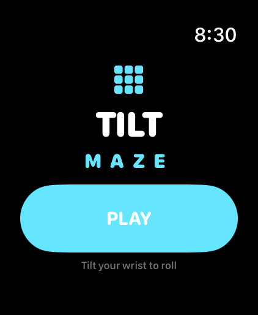
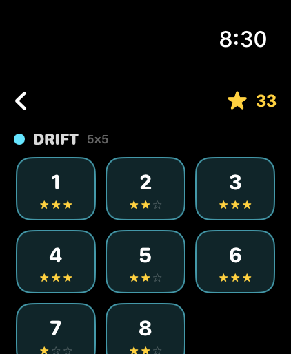
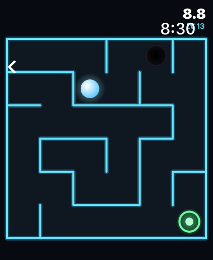
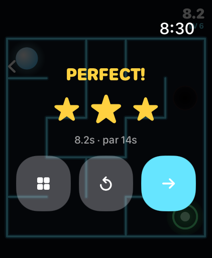

# Tilt Maze 🌀

A **motion-controlled labyrinth** for **Apple Watch** (built for the Watch Ultra,
runs on watchOS 10+). **Tilt your wrist** to roll a glowing ball through neon
mazes — thread the corridors, avoid the pits, reach the green portal as fast as
you can. **36 generated levels** across four worlds, with star ratings and saved
progress.

Built entirely in **SwiftUI**: the ball physics runs in a `Canvas` + `TimelineView`
loop with sub-stepped circle-vs-wall collision (it can't tunnel through walls),
and steering comes from **CoreMotion** gravity. Taptic Engine bumps when you hit a
wall. No companion iPhone app required.

## Screenshots

_Captured on the Apple Watch Ultra 3 (49mm) simulator._

| Title | Levels | Maze | Solved |
|:-----:|:------:|:----:|:------:|
|  |  |  |  |

---

## Controls

| Input | Action |
|-------|--------|
| **Tilt your wrist** | Roll the ball (real gravity via CoreMotion) — *on a physical watch* |
| **Drag on screen** | Steer the ball — fallback used in the **Simulator** (drag-and-hold toward a direction to tilt that way) |

## How it plays

- Roll the ball from the start to the glowing **green portal**.
- **Holes** (dark pits) reset you to the start with a time penalty — route around them.
- A **timer** runs; finishing under **par** earns **3 stars** (2 / 1 for slower).
- Four worlds of increasing size and hole density: **Drift** 5×5 → **Grid** 6×6 →
  **Vault** 7×7 → **Core** 8×8. Clear a level to unlock the next.
- Every maze is a **perfect maze** (exactly one path between any two cells),
  generated deterministically — so each level is the same every time, and always
  solvable.

---

## Build & run

Requires **Xcode 16+** (developed on Xcode 26.5 / watchOS 26.5 SDK) on a Mac.

```bash
git clone https://github.com/at0m-b0mb/TiltMaze.git
cd TiltMaze
open TiltMaze.xcodeproj
```

1. Select the **Tilt Maze Watch App** scheme.
2. **Simulator:** press **Run** (⌘R). The Simulator has no motion sensors, so the
   game automatically switches to **drag-to-steer** — drag and hold on the watch
   face toward the direction you want to roll.
3. **Your Apple Watch Ultra:** set your Team under *Signing & Capabilities* (needs
   a paid Apple Developer account to sideload), pick your watch, Run — then **tilt
   the watch** to play for real.

> **Tilt feels inverted?** Flip the signs in `MazeGame.applyMotionTilt()` — wrist
> orientation/handedness can swap an axis. It's a one-line tweak.

### Command-line build check

```bash
DEVELOPER_DIR=/Applications/Xcode.app/Contents/Developer \
xcodebuild -project TiltMaze.xcodeproj -scheme "Tilt Maze Watch App" \
  -sdk watchsimulator26.5 -destination 'generic/platform=watchOS Simulator' \
  -derivedDataPath /tmp/TiltMazeDD CODE_SIGNING_ALLOWED=NO build
```

---

## Project layout

```
TiltMaze/
├─ TiltMaze.xcodeproj
├─ Screenshots/
└─ TiltMazeWatchApp/
   ├─ TiltMazeApp.swift      # @main entry, owns the MazeGame
   ├─ ContentView.swift      # phase router + title screen
   ├─ LevelSelectView.swift  # Crown-scrollable world/level map with stars
   ├─ GameView.swift         # Canvas host: physics loop + tilt/drag + win overlay
   ├─ MazeGame.swift         # engine: ball physics, collisions, levels, stars
   ├─ MazeRenderer.swift     # stateless neon-maze drawing
   ├─ MotionManager.swift    # CoreMotion gravity → tilt
   ├─ Models.swift           # maze generator (recursive backtracker) + types
   ├─ Haptics.swift          # Taptic Engine wrapper
   └─ Assets.xcassets        # app icon + accent colour
```

## Tuning

Physics feel (gravity strength, friction, max speed, bounce) and the level/world
table live at the top of **`MazeGame.swift`**. Maze generation is in
**`Models.swift`** (`MazeFactory`); the look is in **`MazeRenderer.swift`**.

> Screenshots were generated with a **Debug-only** demo hook in `MazeGame.swift`
> (gated behind the `TM_DEMO` launch environment variable, compiled out of
> Release), e.g. `SIMCTL_CHILD_TM_DEMO=play xcrun simctl launch booted com.at0mb0mb.tiltmaze`.
